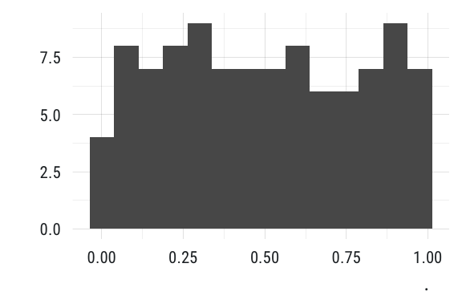
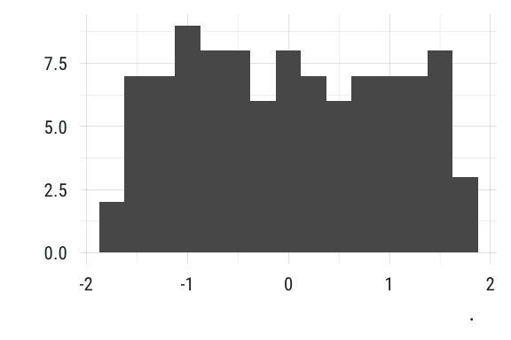
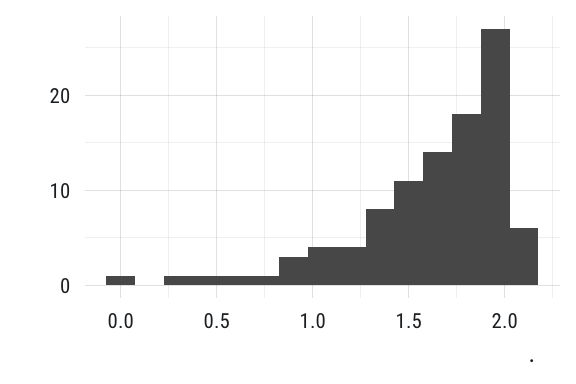
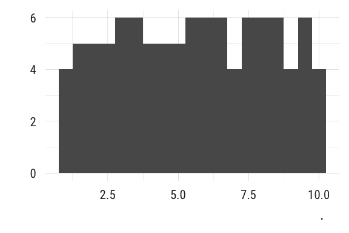

<!-- README.md is generated from README.Rmd. Please edit that file -->

# tfse 

[](https://www.tidyverse.org/lifecycle/#experimental)

tfse = **T**he **F**irst **S**criptorium **E**mporium

## Install

To install the package

``` r
## install from github
devtools::install_github("mkearney/tfse")
```

## Usage

Load the package and go

``` r
## load pkg
library(tfse)

## use functions like col2hex
col2hex("greenyellow")
#> [1] "#ADFF2F"

## rescale values
x <- sample(-10:100, 100)

## rescale standard
rescale_standard(x) %>%
  ggplot2::qplot(binwidth = .075) + 
  theme_mwk()
```

<!-- -->

``` r
## rescale normal
rescale_normal(x) %>%
  ggplot2::qplot(binwidth = .25) + 
  theme_mwk()
```

<!-- -->

``` r
## rescale log
rescale_log(x) %>%
  ggplot2::qplot(binwidth = .15) + 
  theme_mwk()
```

<!-- -->

``` r
## rescale standard
rescale_pointscale(x, 1, 10) %>%
  ggplot2::qplot(binwidth = .5) + 
  theme_mwk()
```

<!-- -->

## Help

View the help documentation

``` r
## view R help documentatoin
help(package = "tfse")
```

## about tfse

  - This is my personal R package of utility functions
  - Why *tfse*? The acronym was creatively reconfigured from its
    originally intended state
