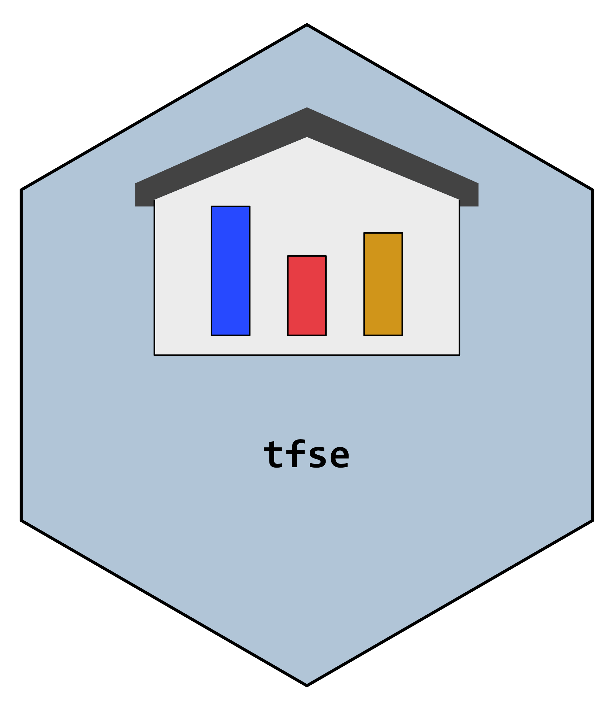

<!-- README.md is generated from README.Rmd. Please edit that file -->

# tfse 

[](https://travis-ci.org/mkearney/tfse)
[](https://codecov.io/github/mkearney/tfse?branch=master)

[](https://www.tidyverse.org/lifecycle/#experimental)

Various useful functions for working with data and writing functions

## Install

Install from CRAN

``` r
## from CRAN repo
install.packages("tfse")
```

Install dev version from Github

``` r
## from github
remotes::install_github("mkearney/tfse")
```

## Usage

### Scales

Rescale to standard (0-1) scale

``` r
## 0-1 scale
rescale_standard(-2:2)
#> [1] 0.00 0.25 0.50 0.75 1.00
```

Rescale to normal (mean = 0; sd = 1) scale

``` r
## z scores
rescale_normal(-2:2)
#> [1] -1.2649111 -0.6324555  0.0000000  0.6324555  1.2649111
```

Rescale to arbitrary lower/upper bounds

``` r
## specify new scale bounds
rescale_pointscale(-2:2, 1, 10)
#> [1]  1.00  3.25  5.50  7.75 10.00
```

### Citations

Print out the APA-formatted citation for R packages.

``` r
## print out APA citation for {rtweet}
apa_citation("rtweet")
#> ↪ Adding APA citation of {rtweet} to clipboard!
#> ✔ Ready to paste!
#> 
#> Kearney, M. W. (2018). rtweet: Collecting twitter data (R package version
#>     0.6.7) [Computer software]. The Comprehensive R Archive Network. Available
#>     from https://cran.r-project.org/package=rtweet
```

### Annotate script files

Use `box_code()` to add a header-like chunk to your clipboard–paste in
script as desired.

``` r
## store text in clipboard
box_code("EXAMPLE #1")

## the pasted output:
##----------------------------------------------------------------------------##
##                                 EXAMPLE #1                                 ##
##----------------------------------------------------------------------------##
```

### Regular expressions

Get all regular expression matches (using easier
looka-heads/look-behinds)

``` r
## some text
x <- c("This *is* a test", 
  "#this *was* a test", 
  "This *will* be a test!",
  "This *has been* a test; it *is* great.")

## return text between asterisks, return as atomic vector
regmatches_(x, "(?<=\\*)\\S[^*]+(?=\\*)", drop = TRUE)
#> [1] "is"       "was"      "will"     "has been" "is"
```

### Github

Figure out the name of a Github repo for a given package

``` r
## repo name of devtools
desc_gh_repo("devtools")
#> [1] "r-lib/devtools"
```

Convert a Github link to the raw URL version

``` r
## path to raw version of Github file
github_raw("https://github.com/mkearney/driven-snow/blob/master/theme/driven-snow.rstheme")
#> [1] "https://raw.githubusercontent.com/mkearney/driven-snow/master/theme/driven-snow.rstheme"
```

## Help

View the help documentation

``` r
## view R help documentatoin
help(package = "tfse")
```

## about tfse

  - This is my personal R package of utility functions
  - Why *tfse*? The acronym was creatively reconfigured from its
    originally intended state
